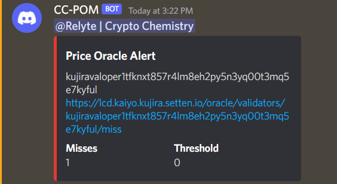
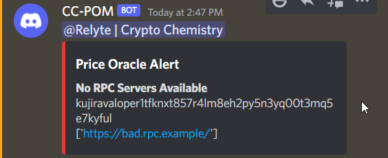

# Crypto Chemistry Price Oracle Monitor (CC-POM)

CC-POM aims to make monitoring price oracle misses easier by monitoring set addresses and alerting validators over Discord or Pagerduty

# Supported Chains

Currently only Kujira is supported at this time.

# Usage

The easiest way to run this is using docker-compose.

## Docker-Compose

Clone the repository

```
git clone https://github.com/Crypto-Chemistry/price-oracle-monitor.git
```

Move example.docker-compose.yml to docker-compose.yml

```
mv example.docker-compose.yml docker-compose.yml
```

Edit docker-compose.yml and modify the variables. After the `-a` flag, a list of space-separated addresses to monitor should be provided. These do not need to belong to the same chain. After the `-w` flag, add the Discord webhook for the channel that you want to receive missed vote notifications on.

Example docker-compose.yml command segement:

```
command: "price_oracle_monitor.py \
              -a kujira1tfknxt857r4lm8eh2py5n3yq00t3mq5eerh6qs \ 
              -w https://discord.com/api/webhooks/1234567890123456789/abcdefghijklmnop-1A-2B3CD4-e5f6g7h8i9j10 \
              -t 50"
```

Build the image

```
docker-compose build --no-cache
```

Run the application (It acts as a one-shot similar to Restake. To configure it as a repeated service, see [Configuring a Price Oracle Monitor Service](#configuring-a-price-oracle-monitor-service))

```
docker-compose run price_oracle_monitor
```

## Running from source

Running this application from source is a bit more work to set up reliably and comes with additional requirements.

Python 3.10 or greater must be installed for this function properly. However, it has only been tested on Python 3.10.5 so far.

Clone the repository

```
git clone https://github.com/Crypto-Chemistry/price-oracle-monitor.git
```

Switch to the repo directory

```
cd price-oracle-monitor
```

Pull down the library dependencies

```
pip3 install -r requirements.txt
```

Run the price_oracle_monitor.py script with the required arguments

```
python3 price_oracle_monitor.py -a address1 address2 -w discord_webhook_url
```

Example command:

```
python3 price_oracle_monitor.py -a kujira1tfknxt857r4lm8eh2py5n3yq00t3mq5eerh6qs clan1wg7nrqc29veuzw9p6ujhad697a3tpzl3zrfplr \
                                -w https://discord.com/api/webhooks/1234567890123456789/abcdefghijklmnop-1A-2B3CD4-e5f6g7h8i9j10 \
                                -t 50
```

## Update Instructions

To update to a newer version navigate to where the repo is cloned and run the following commands

```
git fetch --all
git pull
```

If using the Docker Compose method to run the application, make sure to force rebuild the image:

```
docker-compose kill
docker-compose build --no-cache
```

If running from source, make sure to reinstall the requirements.txt file in case new dependencies have been added:
```
pip3 install -r requirements.txt
```

# Configuring a Price Oracle Monitor Service

To configure CC-POM as a service, first create a service file.

```
sudo nano /etc/systemd/system/cc-pom.service
```

Copy the following contents into the `cc-pom.service` file, replacing the WorkingDirectory variable with the path to where the repo is cloned.

```
[Unit]
Description=Price Oracle Monitoring Service
Requires=docker.service
After=docker.service

[Service]
Type=oneshot
WorkingDirectory=/path/to/cc-pom
ExecStart=/usr/bin/docker-compose run price_oracle_monitor

[Install]
WantedBy=multi-user.target
```

Run the following commands to start and enable the service:
```
sudo systemctl enable /etc/systemd/system/cc-pom.service
sudo systemctl start /etc/systemd/system/cc-pom.service
```

# Available Parameters

| Parameter         | Type                       | Required | Description                                                                                              |
|-------------------|----------------------------|----------|----------------------------------------------------------------------------------------------------------|
| -a,--addresses    | String or multiple strings | Yes      | Addresses to monitor                                                                                     |
| -d,--discord      | None                       | No       | Enable Discord notification ('DISCORD_WEBHOOK' must be set as an environment varible to the webhook URL) |
| -f,--frequency    | Float                      | No       | The frequency in minutes that CCPOM checks the API for new misses                                        |
| -k,--key          | String                     | No       | PagerDuty API Key (enables PagerDuty notifications)                                                      |
| -l,--lcd_endpoint | String or multiple strings | No       | API Endpoints to query                                                                                   |
| -p,--pagerduty    | None                       | No       | Enables PagerDuty Notifications ('PD_API_KEY' must be set as an environment variable to the API Key)     |
| -t,--threshold    | Int                        | Yes      | Threshold for misses prior to alerting                                                                   |
| -u,--userid       | String                     | No       | Discord User by UUID to tag in alerts                                                                    |
| -v,--verbose      | None                       | No       | Enable verbose output                                                                                    |
| -w,--webhook      | String                     | No       | Discord Webhook to send alerts to (enables Discord notifications)                                        |
| --delay           | Int                        | No       | Time between repeated notifications in minutes (default 30 minutes)                                                 |


## Examples

### Send PagerDuty and Discord Alerts with environment variables set

```
python3 price_oracle_monitor.py -a kujira1tfknxt857r4lm8eh2py5n3yq00t3mq5eerh6qs \
                                -d \
                                -p \
                                -t 50
```

### Send PagerDuty and Discord Alerts without environment variables set

```
python3 price_oracle_monitor.py -a kujira1tfknxt857r4lm8eh2py5n3yq00t3mq5eerh6qs \
                                -w "discord_webhook_url_here" \
                                -k "pagerduty_eventsv2_key_here" \
                                -t 50
```

### Send PagerDuty and Discord Alerts without environment variables set, tag a user in the Discord notification, and delay repeated notifications for 3 hours per notification

```
python3 price_oracle_monitor.py -a kujira1tfknxt857r4lm8eh2py5n3yq00t3mq5eerh6qs \
                                -w "discord_webhook_url_here" \
                                -k "pagerduty_eventsv2_key_here" \
                                -u "123456789123456789" \
                                --delay 180 \
                                -t 50
```

### Example Discord Notifications


